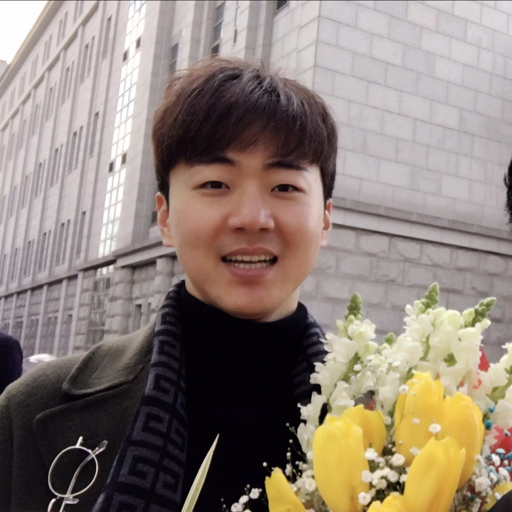

### About Me
I am a Postdoctoral Researcher in the Statistics Department at the [University of Wisconsin–Madison](https://stat.wisc.edu/), where I work with 
Dr. [Matthias Katzfuss](https://sites.google.com/view/katzfuss/home?authuser=0).

I received my Ph.D. in Statistics from the University of Georgia in 2025, where I was co-advised by 
Drs. [Jaewoo Lee](https://www.ai.uga.edu/directory/people/jaewoo-lee) and [Yuan Ke](https://yuan-ke.github.io/). 
Prior to that, I completed my M.A. in Applied Statistics at [Yonsei University](https://devcms.yonsei.ac.kr/stat_en/index.do) in 2018 
under the guidance of Dr. [Sangun Park](https://devcms.yonsei.ac.kr/faculty/name_search.do?mode=view&userId=CmRXJlwS0DJ2cQUfMSCViw%3D%3D&sosokcd=0000203), 
and my B.A. in Applied Statistics at Yonsei University in 2016.

My research focuses on **deep learning optimization**, with an emphasis on gradient-based methods that leverage second-order information. 
I aim to develop optimization algorithms that are both theoretically principled and computationally efficient, enabling the scalable training of large-scale vision and language models.

- Email: `88hseung at gmail dot com`
- [Google Scholar](https://scholar.google.com/citations?user=qgzaJCcAAAAJ&hl=en)
